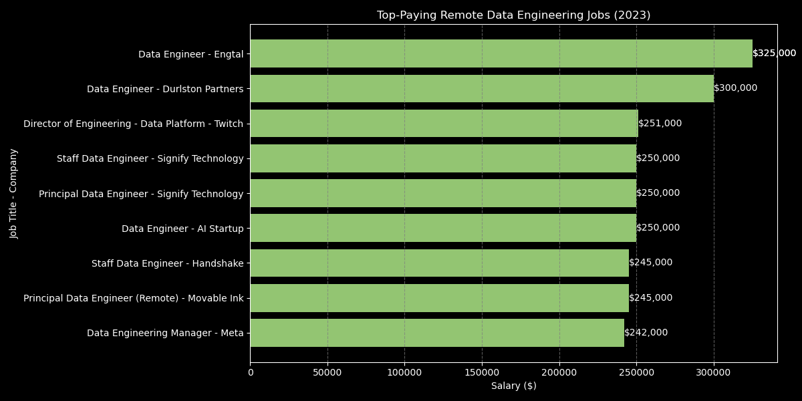

# Introduction
Explore the data job market with a focus on data engineer roles. This project delves into top-paying positions, essential skills, and where high demand meets high salary in data engineering.

SQL query? Check them out here: [project_sql folder](/project_sql/)
# Background
Driven by a quest to navigate the data engineer job market more effectively, this project was born from a desire to pinpoint top-paid and in-demand skills, streamlining others work to find optimal jobs.

Data hails from my [SQL Course](https://www.lukebarousse.com/sql) It's packed with insights on job titles, salaries, locations, and essential skills.

### The questions I wanted to answer through my SQL queries were:
1. What are the top-paying data engineer jobs?
2. What skills are required for these top-paying jobs?
3. What skills are most in demand for data engineer?
4. Which skills are associated with higher salaries?
5. What are the most optimals skills to learn? 

# Tools I Used
For my deep dive into the data analyst job market, I harnessed the power of several key tools:

- **SQL:** The backbone of my analysis, allowing me to query the database and unearth critical insights.
- **PostgreSQL:** The chosen database management system, ideal for handling the job posting data.
- **Visual Studio Code:** My go-to for database management and executing SQL queries.
- **Git & GitHub:** Essential for version control and sharing my SQL scripts and analysis, ensuring collaboration and project tracking.

# The Analysis
### 1. Top Paying Data Engineer Jobs
To identify the highest-paying roles, I filtered data analyst positions by average yearly salary and location, focusing on remote jobs. This query highlights the high paying opportunities in the field.

```sql
SELECT
    job_id,
    job_title,
    job_location,
    job_schedule_type,
    salary_year_avg,
    job_posted_date,
    name AS company_name 
FROM job_postings_fact
LEFT JOIN company_dim ON job_postings_fact.company_id = company_dim.company_id
WHERE
    job_title_short = 'Data Engineer' AND
    job_location = 'Anywhere' AND
    salary_year_avg IS NOT NULL
ORDER BY
    salary_year_avg DESC
LIMIT 10;
```
Here's the breakdown of the top data engineer jobs in 2023:
- **Highest Paying Role:**
    - Data Engineer at Engtal, offering the maximum salary of $325,000 per year.
- **Common Roles and Salaries:** 
    - Predominant job title is Data Engineer, with salaries ranging from $242,000 to $325,000 annually.
    - Other notable roles include Director of Engineering and Staff Data Engineer.
- **Frequent Employers:**
    - Companies like Engtal and Signify Technology have multiple high-paying listings, emphasizing their investment in top data engineering talent.


*This bar chart shows the top-paying remote data engineering jobs in 2023. Each bar displays job titles and their average yearly salaries, ranging from $242K to $325K. ChatGPT generated this chart from my SQL query results.*

### 2. Skills for Top Paying Jobs
To understand what skills are required for the top-paying jobs, I joined the job postings with the skills data, providing insights into what employers value for high-compensation roles
```sql
WITH top_paying_jobs AS (
    SELECT
        job_id,
        job_title,
        salary_year_avg,
        name AS company_name 
    FROM job_postings_fact
    LEFT JOIN company_dim ON job_postings_fact.company_id = company_dim.company_id
    WHERE
        job_title_short = 'Data Engineer' AND
        job_location = 'Anywhere' AND
        salary_year_avg IS NOT NULL
    ORDER BY
        salary_year_avg DESC
    LIMIT 10
)

SELECT
    top_paying_jobs.*,
    skills
FROM top_paying_jobs
INNER JOIN skills_job_dim ON top_paying_jobs.job_id = skills_job_dim.job_id
INNER JOIN skills_dim ON skills_job_dim.skill_id = skills_dim.skill_id
ORDER BY
    salary_year_avg DESC
```

Here's the breakdown of the most demanded skills for data engineers in 2023, based on job postings:
- **Python** is leading with a count of 7
- **Spark** follows with a count of 5
- **Hadoop**, **Kafka**, and **Scala** each with a count of 3
- **Pandas**, **NumPy**, **PySpark**, **Kubernetes**, **SQL**, and **Databricks** each with a count of 2

This data highlights that proficiency in **Python** and **Spark** is particularly important for data engineering roles, while a diverse toolset including **Hadoop**, **Kafka**, and **Scala** is also valued.


*This bar chart displays the top 10 most frequently required skills for remote data engineering jobs in 2023, highlighting Python and Spark as the most in-demand. ChatGPT generated this chart from my SQL query results.*

### 3. In-Demand Skills for Data Engineers
This query help identify the skills most frequently requested in job postings, directing focus to areas with high-demand.

```sql
SELECT
    skills,
    COUNT(skills_job_dim.job_id) AS demand_count
FROM job_postings_fact
INNER JOIN skills_job_dim ON job_postings_fact.job_id = skills_job_dim.job_id
INNER JOIN skills_dim ON skills_job_dim.skill_id = skills_dim.skill_id
WHERE
    job_title_short = 'Data Engineer'
GROUP BY
    skills
ORDER BY
    demand_count DESC
LIMIT 5
```
Here's the breakdown of the most demanded skills for Data Engineer in 2023
- **SQL** and **Python** are the most in-demand skills, essential for database management and data manipulation.
- **AWS** and **Azure** highlight the importance of cloud computing in data engineering, with organizations migrating their data infrastructure to the cloud.
- **Spark** shows significant demand, indicating the need for skills in big data processing and analytics.

| Skill  | Demand Count |
| ------ | ------------ |
| SQL    | 113,375      |
| Python | 108,265      |
| AWS    | 62,174       |
| Azure  | 60,823       |
| Spark  | 53,789       |
*Table of the top 5 most demanded skills in Data Engineer job postings*

### 4. Skills Based on Salary
Exploring the average salaries associated with different skills revealed which skills are the highest paying
```sql
SELECT
    skills,
    ROUND(AVG(salary_year_avg), 0) AS avg_salary
FROM job_postings_fact
INNER JOIN skills_job_dim ON job_postings_fact.job_id = skills_job_dim.job_id
INNER JOIN skills_dim ON skills_job_dim.skill_id = skills_dim.skill_id
WHERE
    job_title_short = 'Data Engineer'
    AND salary_year_avg IS NOT NULL
GROUP BY
    skills
ORDER BY
    avg_salary DESC
LIMIT 25
```
Here's a breakdown of the results for top paying skills for Data Engineer
1. **Emerging Technologies and Frameworks:**
    -  **Node.js** tops the list with an average salary of $181,862, highlighting its importance in building scalable server-side applications.
    - Modern web development frameworks like **Vue.js** and **Next.js** also command high salaries, reflecting their growing demand.

2. **Data Management and NoSQL Databases:**
    - **MongoDB** and **Cassandra** are among the highest-paying skills, with average salaries of $179,403 and $150,255 respectively, indicating a strong need for expertise in NoSQL databases.

3. **Programming Languages and Big Data:**
    - High-paying programming languages include **Clojure** ($153,663), **Rust** ($147,771), and **Scala** ($143,161), which are valued for their efficiency and utility in data processing.
    - Big data technologies like **Kafka** are also highly valued, with an average salary of $143,086, underscoring the importance of real-time data processing skills.

| Skill       | Avg Salary ($) |
|-------------|----------------|
| Node        | 181,862        |
| Mongo       | 179,403        |
| ggplot2     | 176,250        |
| Solidity    | 166,250        |
| Vue         | 159,375        |
| CodeCommit  | 155,000        |
| Ubuntu      | 154,455        |
| Clojure     | 153,663        |
| Cassandra   | 150,255        |
| Rust        | 147,771        |

*Table of the average salary for the top 10 highest-paying skills for data engineers*

### 5. Most Optimal Skills to Learn
Combining insights from demand and salary data, this query aimed to pinpoint skills that are both in high demand and have high salaries, offering a strategic focus for skill development.
```sql
SELECT
    skills_dim.skill_id,
    skills_dim.skills,
    COUNT(skills_job_dim.job_id) AS demand_count,
    ROUND(AVG(salary_year_avg), 0) AS avg_salary
FROM
    job_postings_fact
INNER JOIN skills_job_dim ON job_postings_fact.job_id = skills_job_dim.job_id
INNER JOIN skills_dim ON skills_job_dim.skill_id = skills_dim.skill_id
WHERE
    job_title_short = 'Data Engineer'
    AND salary_year_avg IS NOT NULL
GROUP BY
    skills_dim.skill_id, skills_dim.skills
HAVING
    COUNT(skills_job_dim.job_id) > 10
ORDER BY
    avg_salary DESC,
    demand_count DESC
LIMIT 25;
```
| Skill          | Demand Count | Avg Salary ($) |
|----------------|---------------|----------------|
| Node           | 29            | 181,862        |
| Mongo          | 120           | 179,403        |
| Cassandra      | 269           | 150,255        |
| Rust           | 15            | 147,771        |
| Perl           | 39            | 145,540        |
| Angular        | 42            | 143,319        |
| Scala          | 794           | 143,161        |
| Kafka          | 872           | 143,086        |
| GDPR           | 38            | 142,369        |
| Shell          | 365           | 141,725        |
*Table of the most optimal skills for data engineer sorted by salary*

Here's a breakdown of the most optimal skills for Data Engineer in 2023:

1. **High-Paying Niche Skills:**

- **Node.js** leads with an average salary of $181,862 despite having a relatively low demand count of 29. This indicates that highly specialized skills can command higher salaries even if they are not in high demand.
- **MongoDB** also commands a high average salary of $179,403 with a higher demand count of 120, showing that NoSQL database skills are both valuable and in demand.

2. **Big Data and Cloud Skills:**
- **Cassandra**, **Kafka**, and **Kubernetes** are all in the top-paying skills list, with significant demand counts (269, 872, and 371 respectively) and average salaries above $140,000. This highlights the importance of big data technologies and container orchestration in data engineering roles.
- **IBM Cloud** and **Snowflake** also appear, indicating that cloud platform expertise is highly valued, with Snowflake having a substantial demand count of 1072.

3. Versatile and Popular Technologies:
- **Java** and **Python**-related technologies (like **NumPy**) are in high demand (1154 and 59 respectively) and offer competitive salaries. Java, with an average salary of $137,307 and the highest demand count, reflects its continued relevance in the industry.
- **Scala** and **Shell scripting** (with demand counts of 794 and 365 respectively) also show strong demand and high salaries, indicating their widespread use in data engineering tasks.

# What I Learned
 
Throughout this project, I've significantly enhanced my SQL skills and gained deeper insights into the data engineering job market:

- **Advanced Query Techniques:** Mastered complex SQL queries, effectively using joins and subqueries to extract detailed insights from multiple tables.
- **Data Aggregation and Analysis:** Became proficient with aggregate functions like **COUNT()** and **AVG()**, and used **GROUP BY** to summarize data effectively.
- **Real-World Problem Solving:** Developed my ability to translate real-world questions into actionable SQL queries, providing clear answers and insights.

# Conclusions

### Key Insights

1. **Top-Paying Data Engineer Jobs:** The highest-paying data engineer positions offer substantial salaries, with the top role reaching $325,000 per year. Remote work options are prevalent, highlighting flexibility in the field.
2. **Essential Skills for High-Paying Jobs:** Skills like Python and Spark are crucial for securing top-paying roles. These technologies are highly valued by employers, emphasizing their importance in the data engineering landscape.
3. **Most In-Demand Skills:** SQL and Python are the most demanded skills in the data engineering market. Cloud technologies like AWS and Azure also feature prominently, reflecting the industry's shift towards cloud-based solutions.
4. **Skills with Higher Salaries:** Specialized skills such as Node.js and MongoDB offer the highest average salaries. Mastery of these niche technologies can significantly boost earning potential.
5. **Optimal Skills for Career Growth:** Combining demand and salary data, skills like Kafka, Scala, and Kubernetes are identified as optimal for career growth. These technologies are not only in high demand but also offer competitive salaries.

### Closing Thoughts
This project has not only advanced my SQL capabilities but also provided valuable insights into the current state of the data engineering job market. The findings serve as a strategic guide for skill development, highlighting the technologies and skills that are both highly demanded and well-compensated. Aspiring data engineers can leverage these insights to focus their learning efforts on high-value areas, thereby enhancing their marketability and career prospects. Continuous learning and adaptation to industry trends remain crucial in the ever-evolving field of data engineering.